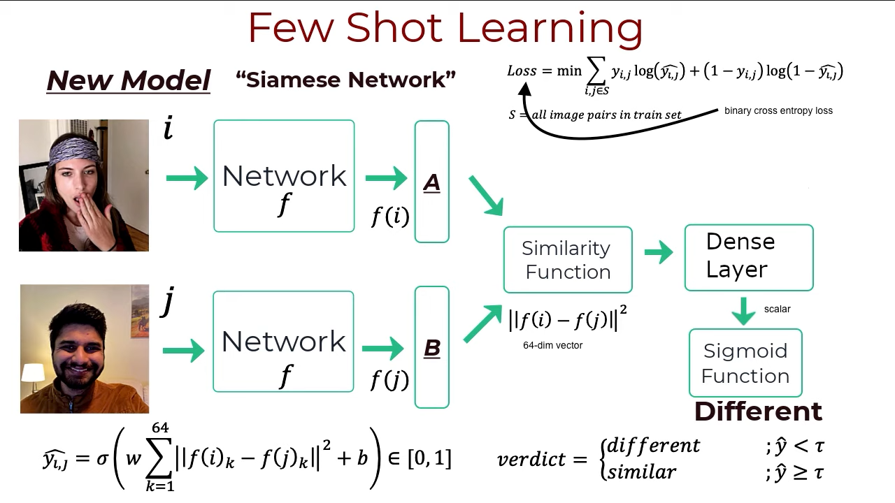

# Report 2023, May 31

This report shows the results of different feature extraction models applied to the ProtoNet pipeline. Follow the `.json` file to read the configuration used for a specific test. 

* Augmentation has been performed on breaks and marks. See Section Open Issues for more details.
* The dataset has been split as (train, val, test) = (70%, 20%, 10%)
* Cropping has been performed for square-shaped images (bubble, point, dirt)

## Models
Here the configuration used during training and test for the different feature extractor models.

### ResNet50_1
Pretrained ResNet50. 28x28 image patches were passed as input.

```json
{
    "epochs": 100,
    "crop_size": 28,
    "image_size": 28,
    "fsl": {
        "episodes": 100,
        "train_n_way": 6,
        "train_k_shot_s": 5,
        "train_k_shot_q": 5,
        "test_n_way": 6,
        "test_k_shot_s": 5,
        "test_k_shot_q": 5
    }
}
```

### ResNet50_2 and HRNet_w18
Pretrained ResNet50. 224x224 (original input dimension for ResNet) image patches were passed as input. The same holds true for HRNet_w18

```json
{
    "epochs": 100,
    "crop_size": 28,
    "image_size": 224,
    "fsl": {
        "episodes": 100,
        "train_n_way": 6,
        "train_k_shot_s": 5,
        "train_k_shot_q": 5,
        "test_n_way": 6,
        "test_k_shot_s": 5,
        "test_k_shot_q": 5
    }
}
```

### Default_1
This model uses the default feature extractor from ProtoNet, with the original input image size. However, only 3 classes are compared for each episode.

```json
{
    "epochs": 100,
    "crop_size": 28,
    "image_size": 105,
    "fsl": {
        "episodes": 100,
        "train_n_way": 3,
        "train_k_shot_s": 5,
        "train_k_shot_q": 5,
        "test_n_way": 3,
        "test_k_shot_s": 5,
        "test_k_shot_q": 5
    }
}
```

### Default_2
This model uses the default feature extractor from ProtoNet, with the original input image size. It is trained and tested to split all the 6 classes of defects.

```json
{
    "epochs": 100,
    "crop_size": 28,
    "image_size": 105,
    "fsl": {
        "episodes": 100,
        "train_n_way": 6,
        "train_k_shot_s": 5,
        "train_k_shot_q": 5,
        "test_n_way": 6,
        "test_k_shot_s": 5,
        "test_k_shot_q": 5
    }
}
```

### Default_c16
This model uses the default feature extractor from ProtoNet, with the original input image size. It is trained and tested to split all the 6 classes of defects. Bubbles, points and dirts have been cropped to 16x16 before upscaling.

```json
{
    "epochs": 100,
    "crop_size": 16,
    "image_size": 105,
    "fsl": {
        "episodes": 100,
        "train_n_way": 6,
        "train_k_shot_s": 5,
        "train_k_shot_q": 5,
        "test_n_way": 6,
        "test_k_shot_s": 5,
        "test_k_shot_q": 5
    }
}
```

### Cnn_1_28
This is a simple custom model with a couple of convolutional layers, enhacned by pooling. The input size is 28x28.

```json
{
    "epochs": 100,
    "crop_size": 28,
    "image_size": 28,
    "fsl": {
        "episodes": 100,
        "train_n_way": 6,
        "train_k_shot_s": 5,
        "train_k_shot_q": 5,
        "test_n_way": 6,
        "test_k_shot_s": 5,
        "test_k_shot_q": 5
    }
}
```

### Cnn_2_105
This is similar to the previous network, but the input has been upscaled to 105x105. There are two additional convolutional layers.

```json
{
    "epochs": 100,
    "crop_size": 28,
    "image_size": 105,
    "fsl": {
        "episodes": 100,
        "train_n_way": 6,
        "train_k_shot_s": 5,
        "train_k_shot_q": 5,
        "test_n_way": 6,
        "test_k_shot_s": 5,
        "test_k_shot_q": 5
    }
}
```

### Cnn_s3q6
This is the equivalent of cnn_1_28 but using 3 classes as prototypes and 6 classes to learn separations (query set).

```json
{
    "epochs": 100,
    "crop_size": 28,
    "image_size": 28,
    "fsl": {
        "episodes": 100,
        "train_n_way": 3,
        "train_k_shot_s": 5,
        "train_k_shot_q": 5,
        "test_n_way": 6,
        "test_k_shot_s": 5,
        "test_k_shot_q": 5
    }
}
```

|            | bubble | point | break | dirt | mark | scratch | **OVERALL** |
| -----------|:------:|:-----:|:-----:|:----:|:----:|:-------:|:-----------:|
| ResNet50_1 | 0.8498 | 0.7780| 1.0   | 0.768|  1.0 | 0.8954  | 0.882       |
| ResNet50_2 | 0.9514 | 0.7952| 1.0   | 0.8  | 1.0  | 0.9996  | 0.924       |
| HRNet_w18  | 0.8660 | 0.7315| 1.0   | 0.686| 1.0  | 1.0     | 0.881       |
| default_1  | 0.8730 | 0.8907| 1.0   | 0.803| 1.0  | 0.9995  | 0.93        |
| default_2  | 0.7992 | 0.7214| 1.0   | 0.571| 1.0  | 1.0     | 0.848       |
| default_c16| 0.7588 | 0.6934| 1.0   | 0.659| 1.0  | 0.9994  | 0.851       |
| cnn_1_28   | 0.8210 | 0.7246| 0.9968| 0.789| 0.998| 0.937   | 0.88        |
| cnn_s3q6   | 0.7516 | 0.7462| 0.9964| 0.748| 0.997| 0.935   | 0.862       |
| cnn_2_105  | 0.8252 | 0.6118| 1.0   | 0.613| 0.998| 0.981   | 0.838       |
| MixerMLP   | 0.8144 | 0.6180| 1.0   | 0.649| 1.0  | 0.9252  | 0.834       |


## CNN comparisons
I performed a couple of comparisons between the two CNN models: in the first case the model was used as feature extractor to then feed a meta-learning pipeline (the ProtoRoutine); then, the same model was added a classification layer to perform standard supervised learning.

* cnn_1_28 gets a overall accuracy of 0.594  
* cnn_2_105 gets a overall accuracy of 0.778

## Open Issues:
Few-Shot Learning usually requires few samples, but the need of splitting the dataset into three (at least two, if evaluation is discarded) parts would eventually require that, with this configuration, I have at least 10 samples for each class in training, evaluation and test dataset. So at least 30 samples per class are required. Standard augmentation (rotations, flipping..) has been applied to classes that could not fulfil this requirement. Therefore, for those classes the accuracy is likely to be very high, because the information processed is related. Generative augmentation could represent a solution to this, unless we can collect other samples.

## Few-Shot Learning

See the [youtube playlist on few-shot-learning].

Applied when you have a low amount of data, it is similar to human learning, because you do not need many examples to memorize the category of a new object. It is also similar to other learning approaches, such as online, continual and incremental learning. The aim of few show learning is being able to separate classes, so during the inference phase it should perform well on unseen classes! Few-shot does not force the use of a well-known pre-trained model to extract features: some models do (e.g. Siamese Network), others don't. Instead, it requires a lot of tasks (combination of them, actually) to learn how to separate classes; the ultimate purpose is to discriminate between classes that have never been previously seen.

[General few-shot explanation].

FSL consists of a set of steps:

1. Divide your dataset into TASKS $T_{i} = \{S_{i}, Q_{i}\}$
   * a TASK is made up of a **support set** and a **query set**
   * each TASK has N ways (classes), each of which with K shots (samples) = N-way-K-shot learning
2. For each task, you have to learn a model from very few examples of the support set and being able to use the model to classify data on the query set
   * classes in each task can be repeated across TASKS.
3. Train: pick random TASKS
4. Test: feed an unseen TASK

Mind that the query set $Q_{i}$ is not only used during inference: indeed, during training the model is first fine-tuned on the support set $S_{i}$ (inner loop) and then its parameters are updated to minimize the loss, with the use of $Q_{i}$.

Few-shot learning benefits from the increment of the number of classes, because it aims at becoming able to separate them.

Labels:

|     | Train | Test |
| --- |:-----:|:----:|
| $S$ | yes   | yes  |
| $Q$ | yes   | no   |

Few-Shot learning belongs to the broader framework of [meta-learning] (check the fb research [conference on meta-learning]), where you have, indeed, Tasks $T_{i} = \{S_{i}, Q_{i}\}$ on which the training is performed, generally speaking:

* Traditional learning:
  * $\hat \theta = \underset{\theta}{\operatorname{\argmin}} \mathcal{L}(\theta, \mathcal{D})$
  * $\hat \theta = \underset{\theta}{\operatorname{\argmin}}\sum_{i=1}^{n} \mathcal{L}(\phi_{i}, \mathcal{D}_{i})$, where
    * $\phi_{i} = f_{\theta}(\mathcal{D_{i}})$, i.e. the model applied to TASK $_{i}$, producing the encoded vector.

### Methods::Siamese Networks (Metric Learning)

|  |
|:------------------------------------------------------:|
| *FSL example: Siamese Network*                         |

They are called Siamese because they are the same network applied to two or more classes. The network is usually a CNN (it is possible to use a well-known model - e.g. AlexNet, ResNet etc.) with the output which is not given by a softmax operation (removed) but an embedding (the previous layer) of $N$ dimensions (flat feature vector of length $N$). A selected similarity function will compute the difference between the vectors (it can be linked to a probability value by passing it to a sigmoid function). The Similarity Function is *prior knowledge*, it is not learned by the network.

The output of the network is a number in the $(0, 1)$ range, so in order to *learn*, it must backpropagate the error to maximize the similarity (getting closer to 1, or 0 if we are using distance metric). A cross entropy loss is used to compare our target (1) with the output of the sigmoid. The backpropagated loss flows to the weights of the fully connected layer.

You can find a [PyTorch implementation] of Siamese Network.

A very similar concept applies to [contrastive learning]

## References
[MixerMLP](https://huggingface.co/timm/mixer_b16_224.miil_in21k_ft_in1k)  
[ProtoNet implementation used](https://github.com/orobix/Prototypical-Networks-for-Few-shot-Learning-PyTorch)

[youtube playlist on few-shot-learning]  
[about few shot learning]  
[hinge loss]  
[PyTorch implementation]  
[siamese implementation (TF) in detail]  
[contrastive learning]

Protonet article:
```bib
@article{DBLP:journals/corr/SnellSZ17,
  author    = {Jake Snell and
               Kevin Swersky and
               Richard S. Zemel},
  title     = {Prototypical Networks for Few-shot Learning},
  journal   = {CoRR},
  volume    = {abs/1703.05175},
  year      = {2017},
  url       = {http://arxiv.org/abs/1703.05175},
  archivePrefix = {arXiv},
  eprint    = {1703.05175},
  timestamp = {Wed, 07 Jun 2017 14:41:38 +0200},
  biburl    = {http://dblp.org/rec/bib/journals/corr/SnellSZ17},
  bibsource = {dblp computer science bibliography, http://dblp.org}
}
```

```bib
@article{tolstikhin2021mixer,
    title={MLP-Mixer: An all-MLP Architecture for Vision},
  author={Tolstikhin, Ilya and Houlsby, Neil and Kolesnikov, Alexander and Beyer, Lucas and Zhai, Xiaohua and Unterthiner, Thomas and Yung, Jessica and Steiner, Andreas and Keysers, Daniel and Uszkoreit, Jakob and Lucic, Mario and Dosovitskiy, Alexey},
  journal={arXiv preprint arXiv:2105.01601},
  year={2021}
}
```


[//]: #
[youtube playlist on few-shot-learning]: <https://www.youtube.com/playlist?list=PL1pUDpkFOnlzeLCZ5aZgSXVZ8BcpCYN8Y>

[FSL benchmarks]: <https://paperswithcode.com/task/few-shot-image-classification>

[about few shot learning]: <https://www.v7labs.com/blog/few-shot-learning-guide>

[hinge loss]: <https://www.mygreatlearning.com/blog/siamese-networks/>

[PyTorch implementation]: <https://towardsdatascience.com/a-friendly-introduction-to-siamese-networks-85ab17522942>

[siamese implementation (TF) in detail]: <https://towardsdatascience.com/how-to-train-your-siamese-neural-network-4c6da3259463>

[contrastive learning]: <https://towardsdatascience.com/understanding-contrastive-learning-d5b19fd96607>