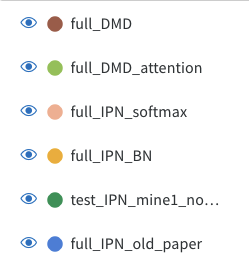

# Improved Prototypical Network

|  |
|:-------------------------------:|
| *IPN Results*                   |

|  |
|:---------------------------:|
| *Legenda*                   |

## full_IPN_old
The previous implementation (from a paper) of Improved Prototypical Network. It used a weight over different samples to build the prototypes and computed weigths for distances making use of both support and query set samples.

## full_DMD vs full_DMD_attention
I implemented a metric distance that takes into account all the distances of a query point from all the clusters simultaneously, instead of comparing all the distances and then choosing the closest centroid.
In the "attentional" version the distance metric and the loss is the same, while the feature extractor includes a channel attention mechanism.

## full_IPN_mine1
In this implementation I used the mean distances from support set from clusters to derive $N$ weights (where $N$ is the number of classes). This could potentially allow the model to use a different number of classes $N$ during training and testing, hence enabling the adaptation to different customers and glass defects.

## full_IPN_BN vs full_IPN_softmax
These includes both the attention mechanism in the feature extractor part and a custom metric distance. In this case, the mean distances of support points from the centroids is used to derive $N$ weights, which will be eventually used to scale distances. The two tests differ because the weights are either normalized with batch normalization or softmax (the latter gives more importance to the most similar).

$J_{i} = \frac{\exp(-\alpha_{n}d(f_{\phi}(x), c_{n}))}{\sum_{j=1}^{N}(\exp(-\alpha_{j}d(f_{\phi}(x), c_{j})))}$

Where $J$ is the loss defined as softmax over euclidean distance ($d$) for a query sample $i$ from all the centroids $c_{n}$ ($N$ number of classes).

Overall, these two return the best accuracy; nevertheless, since the weights of the linear layer that maps $NxN$ distances to $N$ is fixed, it cannot be directly used with a different number of classes without retraining.
